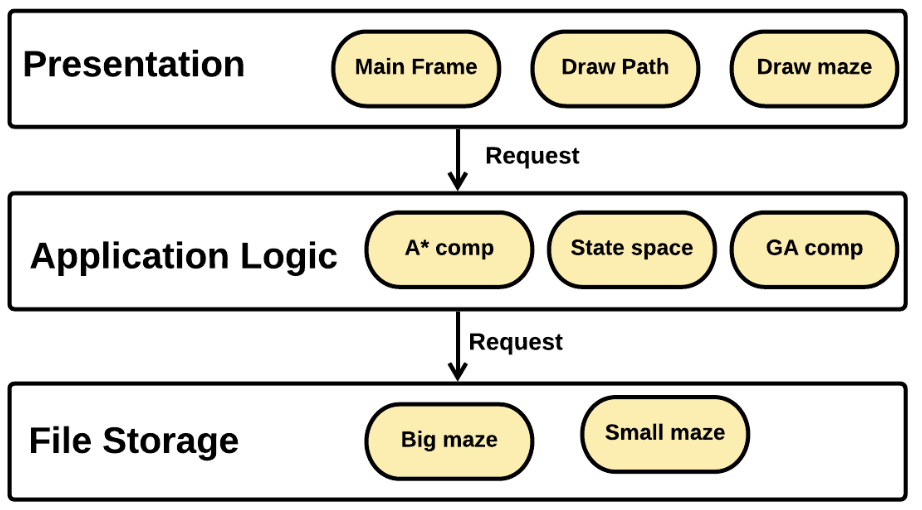
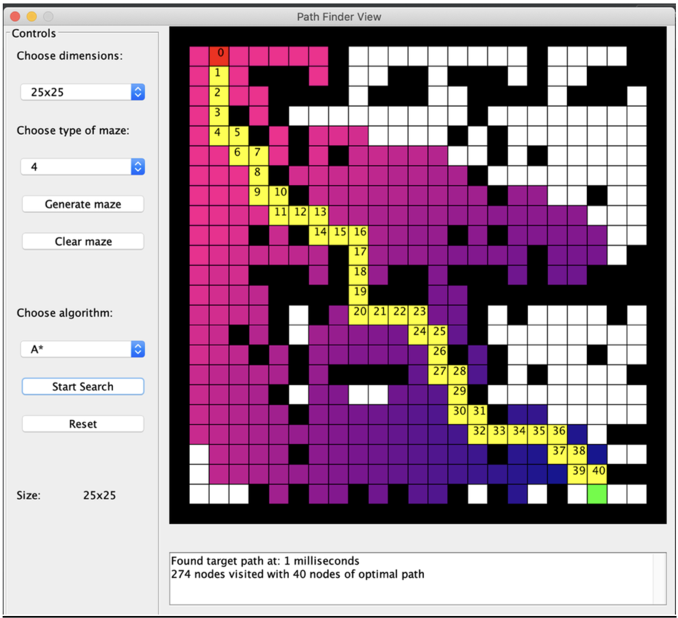
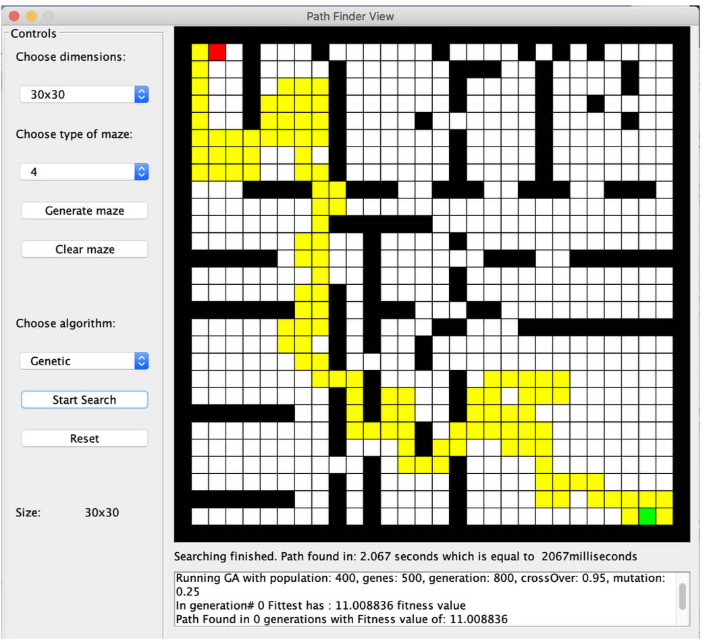

# 🧭 Maze Pathfinding with A* and Genetic Algorithms

This project implements and compares two heuristic pathfinding algorithms — A* and a Genetic Algorithm — applied to solving static 2D mazes.

---

## 📚 Overview

The goal is to explore how different intelligent search techniques can find efficient paths through mazes filled with obstacles. The project includes both algorithm implementation and a simple GUI for visualizing the search process.

The software enables users to:
- Choose maze size and type
- Select between A* and Genetic Algorithm
- Visualize the path search process
- View metrics like visited nodes, time taken, and path length

---

## 🛠️ Technologies Used

- **Language**: Java
- **IDE**: IntelliJ IDEA
- **UI**: Java Swing & AWT
- **Testing**: JUnit 5

No third-party libraries or frameworks are used.

---

## ✨ Key Features

### For Users
- Select maze size and variant via dropdowns
- Reset and regenerate mazes
- Choose algorithm and visualize the result
- Animated display of node traversal and path discovery

### For Each Algorithm
- **A***:
  - Uses Euclidean distance as a heuristic
  - Shows visited nodes and final path in color-coded steps
- **Genetic Algorithm**:
  - Visualizes generations of candidate paths
  - Uses binary-encoded chromosomes for movement
  - Dynamically updates parameters to improve convergence

---

## 🧪 Testing & Evaluation

- Unit tests written using JUnit
- Performance metrics displayed post-search
- Compares both algorithms on:
  - Time taken
  - Number of nodes visited
  - Length of final path

---

## 🧱 Architecture

Uses a **layered architecture** with clear separation:

1. **Presentation Layer** – Handles UI and user interaction
2. **Application Logic Layer** – Contains algorithm implementations
3. **Data Layer** – Manages maze configuration files

Component interactions are managed using standard Java packages.

---

## 🚀 Getting Started

### Prerequisites

- Java Development Kit (JDK 8+)
- IntelliJ IDEA (or any Java IDE)

### How to Run

1. Open the project in your IDE.
2. Run the `MainFrame.java` to launch the application.
3. Select maze size and variant, then choose an algorithm to start.

---

## 📸 Screenshots

### A* algorithm results

### Genetic algorithm results

---

## 📌 Limitations & Future Work

- Currently supports only four-directional movement (no diagonals)
- GA parameters must be well-tuned for performance
- Could benefit from multithreading or improved heuristics
- May explore combining algorithms for hybrid optimization

---

## 👩‍💻 Author

**Radostina Kisleva**
Department of Computer Science, AUBG
Supervisor: John Galletly
Date: November 20, 2020

---

## 📄 License

This project was developed as an academic thesis. For reuse or modifications, please contact the author.